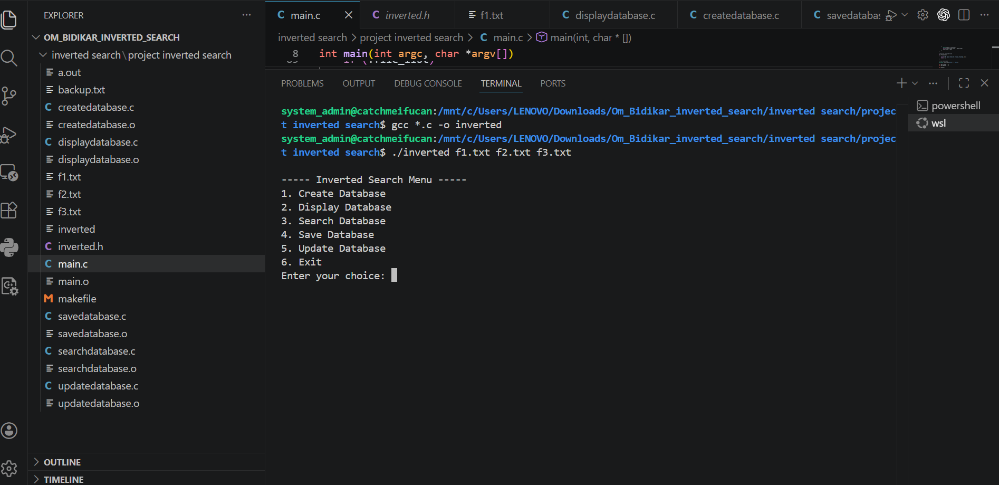
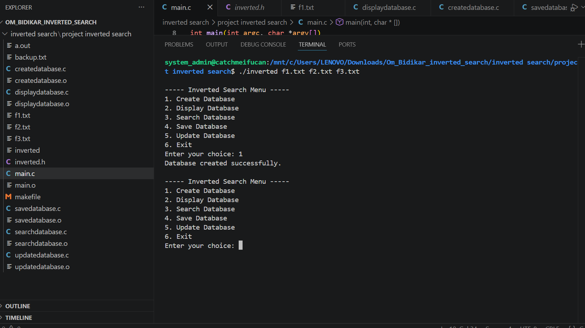
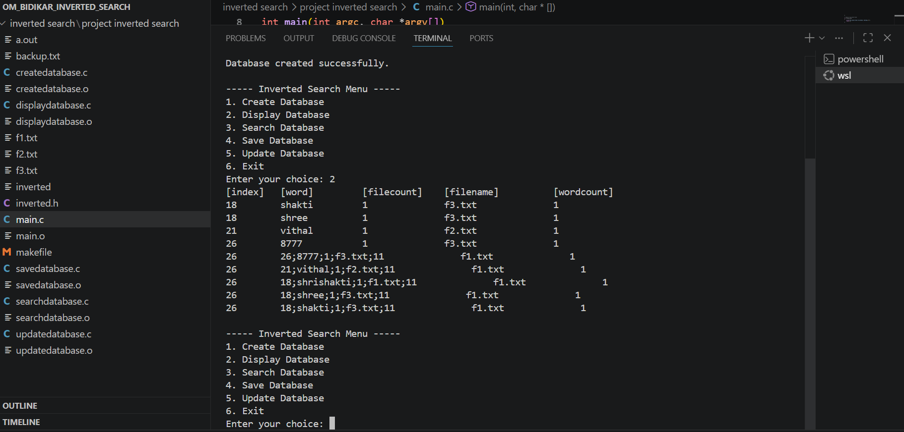
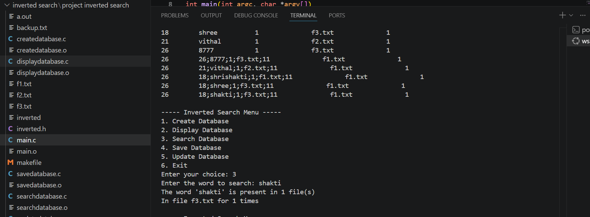
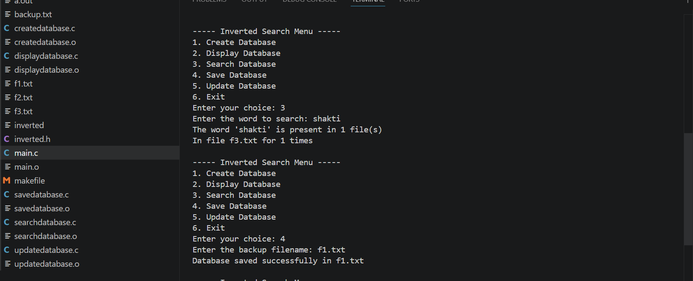

# Inverted Search (C Project)

## Author

Om Bidikar

---

## 📌 About the Project

This project implements an **Inverted Search System** in C.

It processes multiple text files and builds a database that maps each word to:

* The files in which it appears
* The number of occurrences

This technique is widely used in **search engines and indexing systems**.

---

## ✨ Features

* Create database from multiple `.txt` files
* Display the inverted index
* Search for any word
* Save database to a backup file
* Update database from backup file
* Handles:

  * Duplicate files
  * Empty files
  * Invalid file formats

---

## 📁 Project Structure

```id="kbw0qv"
Inverted-Search/
│
├── src/
│   ├── main.c
│   ├── createdatabase.c
│   ├── displaydatabase.c
│   ├── searchdatabase.c
│   ├── savedatabase.c
│   ├── updatedatabase.c
│
├── include/
│   ├── inverted.h
│
├── data/
│   ├── f1.txt
│   ├── f2.txt
│   ├── f3.txt
│   ├── backup.txt
│
├── screenshots/
│   ├── Run.png
│   ├── Create_db.png
│   ├── Display_db.png
│   ├── search_db.png
│   ├── save_db.png
│
├── Makefile
└── README.md
```

---

## ⚙️ How to Compile

```bash id="jz0vlu"
make
```

---

## ▶️ How to Run

```bash id="1n44qe"
./a.out f1.txt f2.txt f3.txt
```

---

## 🧪 Execution Flow

1. Create Database
2. Display Database
3. Search Word
4. Save Database
5. Update Database

---

## 📸 Output Screenshots

### ▶️ Program Execution



---

### 🏗️ Create Database



---

### 📊 Display Database



---

### 🔍 Search Operation



---

### 💾 Save Database



---

## 🧠 Concepts Used

* Hashing (Inverted Index)
* Linked Lists (Main Node & Sub Node)
* File Handling
* String Processing
* Dynamic Memory Allocation

---

## ⚠️ Limitations

* Supports only `.txt` files
* No advanced text preprocessing (stop words, stemming)
* Backup file format is basic

---

## 📘 License

This project is created for learning purposes and can be freely used.
